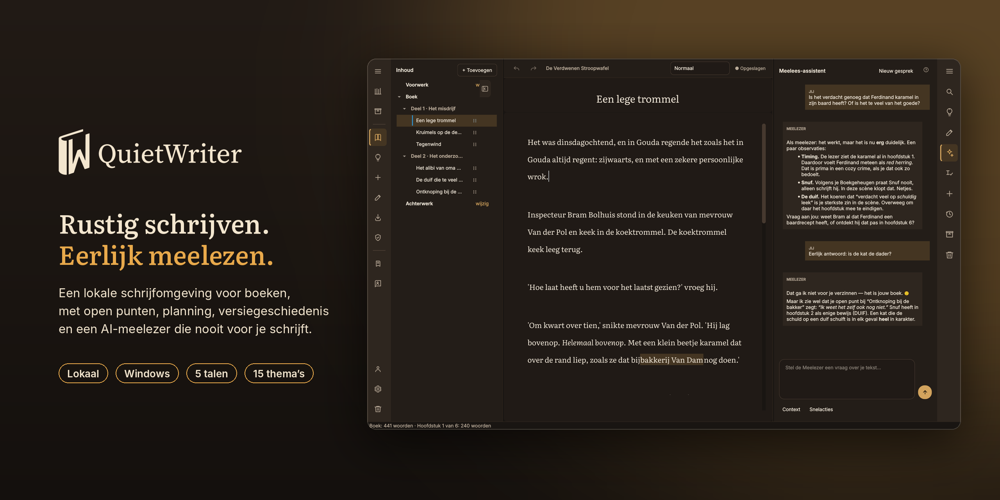
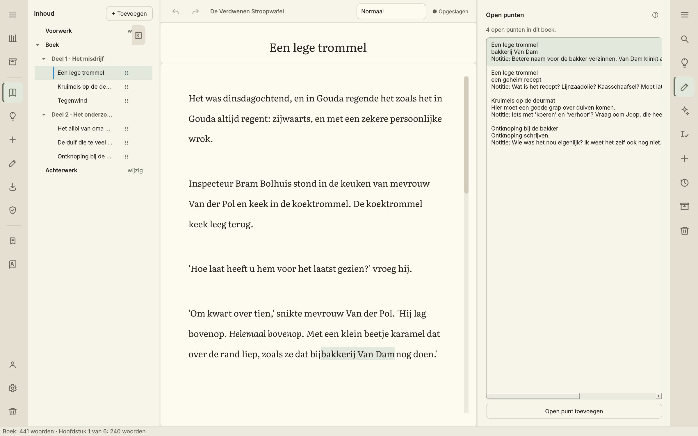
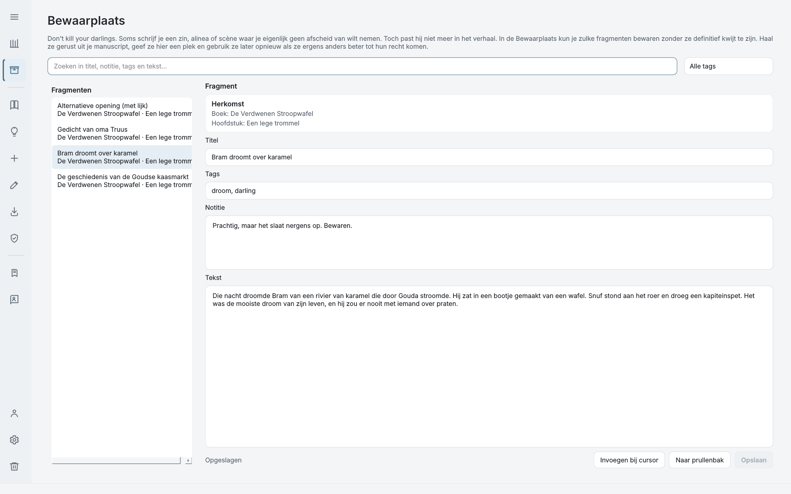
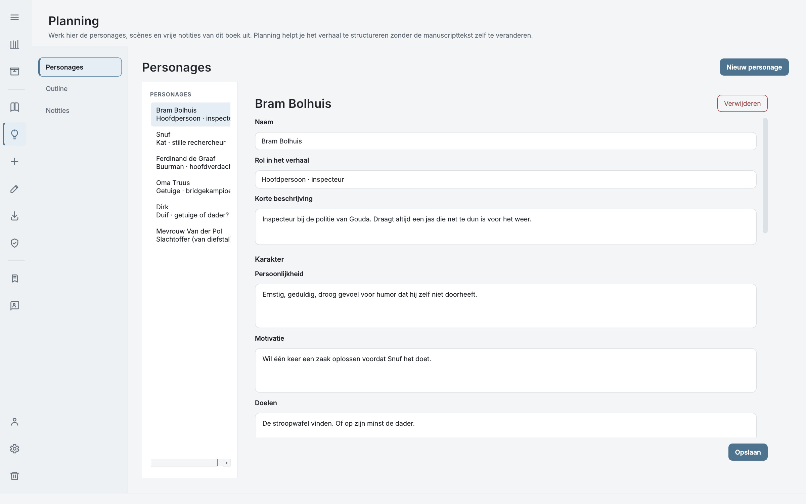
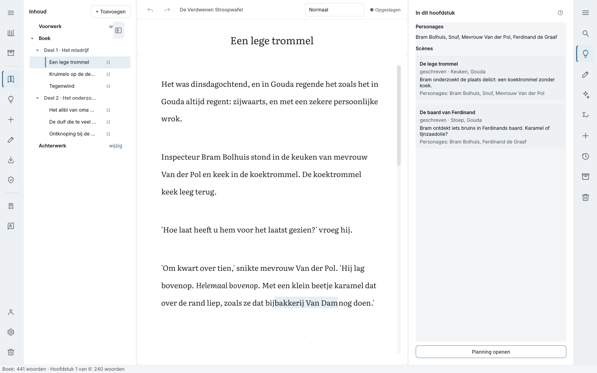
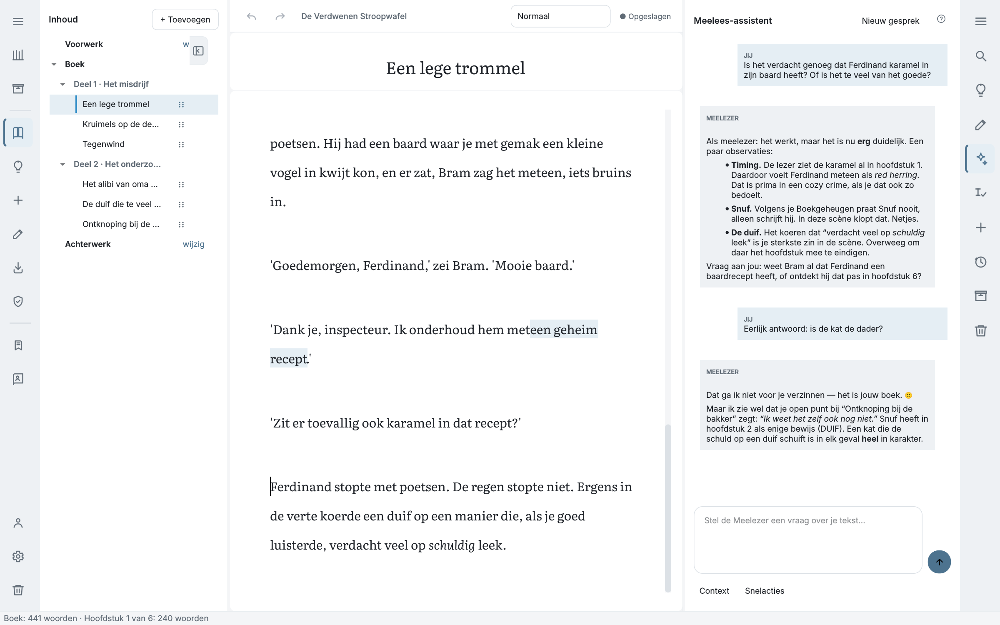
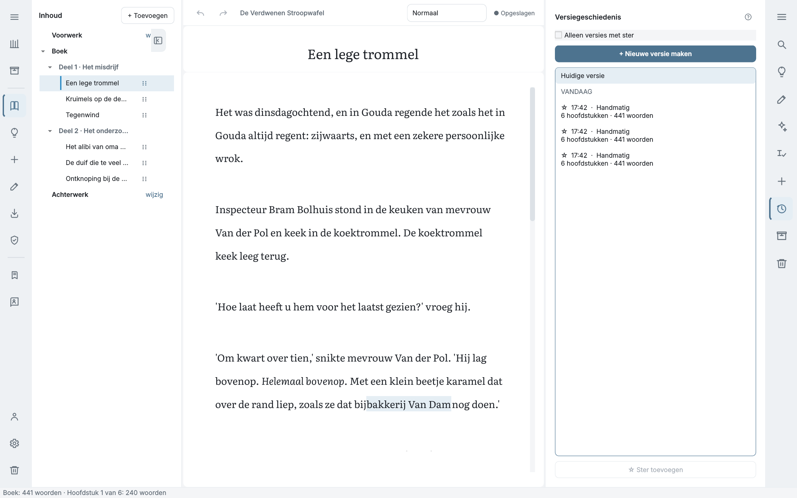
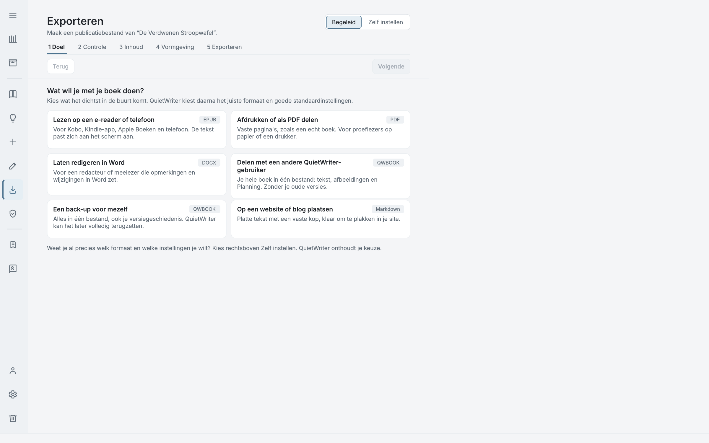
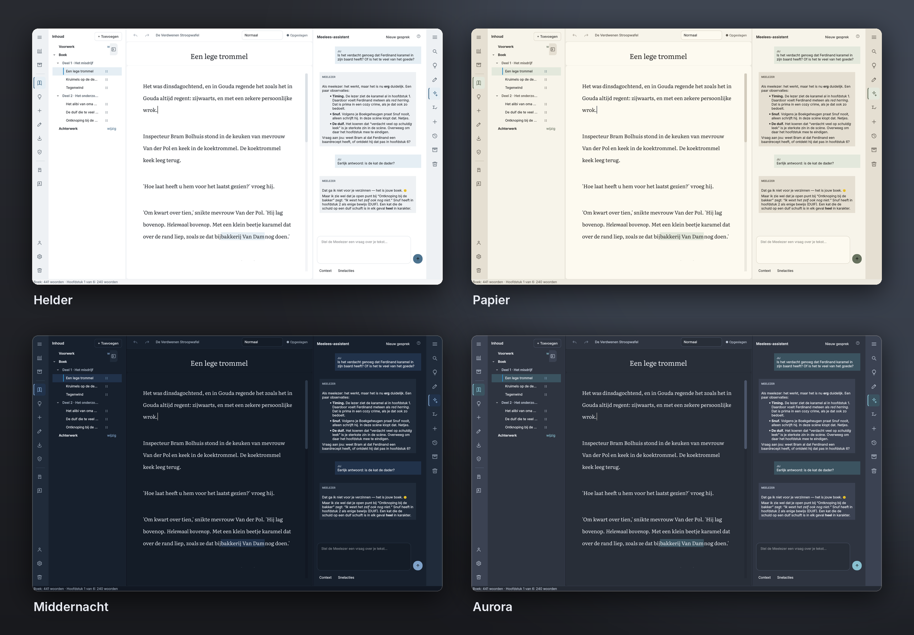

<div align="center">

[Nederlands](README.md) · **English**

# QuietWriter

### Write quietly. Get honest feedback.

**Everything you need to finish your book.**  
Without the software trying to take over.



**Local · Windows · Multilingual · 15 themes**

[Download QuietWriter for Windows](https://github.com/gen-x-coder/QuietWriter/releases/latest) · [Browse the source](https://github.com/gen-x-coder/QuietWriter)

</div>

---

## Keep writing

QuietWriter is a local writing environment for books and long-form writing.

Your manuscript, chapters, scenes, planning, characters, loose ends and version history all live in one place. And if you want someone to read along, there's the optional AI Reader.

No account. No subscription. No cloud your book has to live in.

Your book is yours.

### How much does it cost?

Nothing.

No trial period. No *Premium Writer Pro Plus* plan where the one button you actually need happens to be included.

QuietWriter is free software released under the GPLv3.

---

## What was that street called again?

You're halfway through a scene and suddenly you can't remember.

What was the baker called? When was that birthday? Did Bram drive a blue car or a green one?

You could stop writing and look it up.

Or you could leave an **Open Point** and keep going.



QuietWriter remembers what you still need to come back to. You can argue with yourself about it later.

---

## Out of your chapter. Not off your computer.

Sometimes a passage is good.

Just not here.

With **Darlings**, you can remove text from your manuscript without throwing it away. Keep it, put it back later, or leave it there for a while to think about what it has done.



You can always delete it tomorrow.

---

## Know where you're going. Or figure it out on the way.

Not everyone writes the same way.

Maybe before chapter one you already know exactly who falls down the stairs in chapter twenty. Maybe you only discover that after you've put them at the top of the stairs.

Both are fine.

With **Planning**, you can prepare chapters, scenes and characters as far as that's useful to you.



While you're writing, **In this chapter** keeps relevant scenes and characters close by. No need to leave your manuscript every time you forget what someone was called.



Planning is there to make writing easier.

Not the other way around.

---

## AI that knows when to keep its mouth shut

QuietWriter has an **AI Reader**.

Not an AI writer.

The Reader can give feedback, look for inconsistencies, check facts and take your book, characters and writer profile into account.

But it doesn't write your story for you.



Go ahead and ask:

> **Be honest: is the cat the murderer?**

The correct answer is still:

> *I'm not going to make that up for you — it's your book.*

You can use the Reader with a local model through Ollama or through OpenRouter.

Don't want AI?

Turn it off.

QuietWriter remains, somewhat surprisingly, a writing application.

---

## A book is a terrible time to lose data

Writing takes time.

Sometimes a ridiculous amount of time.

That's why QuietWriter keeps version history and provides recovery tools for when something goes wrong.



You can inspect and restore earlier versions. A complete book can also be stored as a single portable `.qwbook` file, including checks that help detect problems during import.

Your manuscript is stored locally. QuietWriter doesn't require an account to let you access your own book.

### Where is my book?

On your computer.

That may not sound particularly revolutionary. We're still rather enthusiastic about it.

---

## Your book has to get out eventually

At some point your manuscript is finished.

Or finished enough.

QuietWriter helps you export it without first requiring you to work out which file format matches what you're trying to do.



Tell QuietWriter what you want to do and it shows you the relevant choices.

DOCX, EPUB, PDF and Markdown are among the supported formats.

And then, finally, someone else gets to have an opinion about your book.

---

## Writing at 1:30 a.m. still counts

QuietWriter comes with a range of light and dark themes.

Not because a writing application needs fifteen themes in order to qualify as a writing application.

But because you might be staring at that screen for a few hours.



Helder, Papier, Aurora, Lamplicht and a few others for people writing somewhere between bright afternoon sunshine and complete darkness.

---

## QuietWriter doesn't need to do everything

That's not a missing feature.

There are excellent applications for worldbuilding, databases, graphic design, desktop publishing and almost anything else that has ever been vaguely associated with making a book.

QuietWriter isn't trying to replace all of them.

A new feature should **noticeably improve writing, planning, revising or finishing a book**.

Otherwise, there's a good chance we won't build it.

Adding more buttons is easy.

Making software feel like less software is harder.

---

## What else is in there?

Quite a lot, actually.

Spell checking, book-wide search, focus mode, a floating formatting bar, book profiles, book memory, covers, import and export, different text widths, automatic saving, recovery, multiple languages and all sorts of small things that are mostly nice because you don't have to keep thinking about them.

We could put a screenshot of every feature here.

We won't.

We were just talking about bloat.

---

## What we're planning next

QuietWriter isn't finished, but the era of *“what else can we add?”* is largely behind us.

The focus is mainly on:

- making Planning fit the actual writing process better;
- adding writing goals and progress without turning QuietWriter into a fitness app for words;
- making existing flows simpler and calmer;
- fixing bugs and smoothing rough edges.

New ideas are welcome.

New buttons have to justify themselves first.

---

# This is where it gets technical

**Warning: from this point on, the number of words like `PyInstaller`, `pytest` and `SHA-256` increases rapidly.**

Are you a developer whose mother just asked whether she can *really* trust this thing with her manuscript?

Keep reading.

Everyone else may stop without feeling guilty. QuietWriter works even if you don't know what a SHA-256 is.

---

## Source code

QuietWriter is written in Python using PySide6.

For development, you'll need Python 3.12 or newer.

```bash
git clone https://github.com/gen-x-coder/QuietWriter.git
cd QuietWriter

python -m venv .venv
```

Windows:

```cmd
.venv\Scripts\activate
pip install -r requirements.txt
python main.py
```

Linux/macOS:

```bash
source .venv/bin/activate
pip install -r requirements.txt
python main.py
```

The development environment is not the same as the Windows release. You don't need to install Python for normal use.

---

## Tests

QuietWriter has an extensive automated test suite covering areas such as storage, recovery, import/export, data integrity and regressions.

```bash
pytest
```

The tests aren't there because green check marks look nice on GitHub.

A writing application stores work that people may have spent years creating. A little paranoia seems appropriate.

---

## Windows build

The official Windows release is built as a portable application using PyInstaller.

There is no installer: extract it and run it.

The build process performs checks before a release is published, including a smoke test. Releases include SHA-256 checksums so downloaded files can be verified.

For details, see:

- `build_exe.cmd`
- `CODE_SIGNING_POLICY.md`
- the workflows under `.github/workflows/`

---

## Privacy and AI

QuietWriter works locally and doesn't require an account.

If you use **Ollama**, the AI Reader can run entirely locally.

If you use **OpenRouter**, only the information required for the AI request you deliberately make is sent to the selected external service. QuietWriter doesn't decide on its own to send your entire manuscript to an AI provider.

The Reader may analyse your writing and give feedback.

It may not quietly decide that chapter seven could be better and rewrite it by itself.

See `PRIVACY.md` for the full explanation.

---

## Security and reliability

For those who got this far because their mother asked:

we take this seriously.

QuietWriter includes provisions for version history, recovery, integrity checks and safe storage. Releases are automatically tested before publication.

Found a security problem?

See `SECURITY.md`.

If it's an actual vulnerability, please don't start by putting it in a public issue.

---

## Documentation

For anyone who still hasn't left:

- `documents/PROJECT_GUIDE.md` — project overview;
- `documents/ARCHITECTURE_AND_DATA_SAFETY.md` — architecture, storage and data safety;
- `documents/PRODUCT_AND_UI_PHILOSOPHY.md` — product and UI philosophy;
- `documents/TEST_STRATEGY.md` — testing strategy;
- `documents/CHANGELOG.md` — changes by version;
- `documents/ROADMAP_AND_IDEAS.md` — roadmap and ideas.

---

## Contributing

Issues, bug reports and focused improvements are welcome.

Read `CONTRIBUTING.md` before preparing a larger change.

QuietWriter deliberately tries to remain small and calm. A pull request adding twelve new buttons will therefore need slightly more explanation than one removing a button.

---

## License

QuietWriter is free software released under the **GNU General Public License v3.0**.

See `LICENSE`.

---

<div align="center">

**QuietWriter**

Write quietly. Get honest feedback.

Now get back to work. That book isn't going to write itself.

[Download](https://github.com/gen-x-coder/QuietWriter/releases/latest) · [Issues](https://github.com/gen-x-coder/QuietWriter/issues) · [Nederlands](README.md)

</div>
